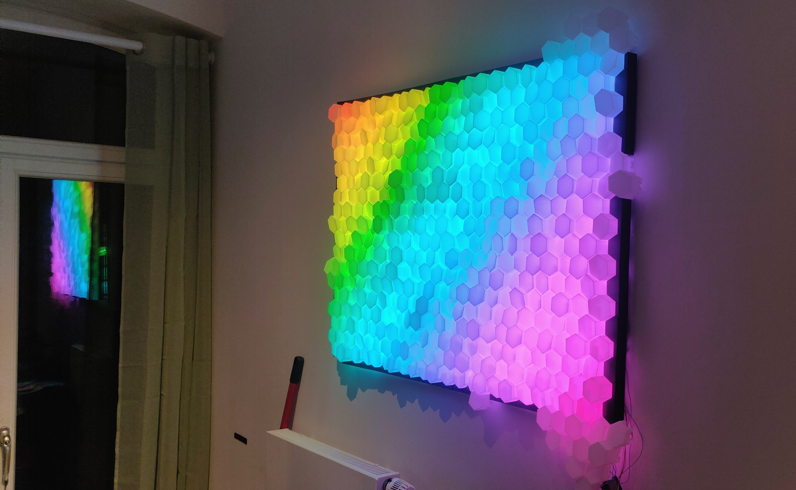

hexadisplay
===========



Setup
-----

### Parts list:

- Clip frame 70x100 (e.g. [this one](https://www.amazon.de/FlexiPeople-Cliprahmen-Bilderrahmen-Plakatrahmen-Rahmenlos/dp/B07ZXPSWK7/))
- ~3 spools of white filament. PLA
- 1 spool of black filament. PLA
- 2x WS2812B strips. Length: 5m. 30 LEDs per meter.
- Aluminiom foil

### 3D Printing

Here be dragons.
For now look in the scad folder.

### Wiring diagram

Here be dragons.

### Assembly

Here be dragons.

### Firmware

Prereq:

- Make sure platformio is installed
- Connect the ESP32 to the usb port

```bash
cd firmware
make upload
```

### send a picture

Prereq:

- Firmware is flashed
- everything is wired up

```bash
cd clients/send_image
cargo run 192.168.69.155:1234 /path/to/file
```
